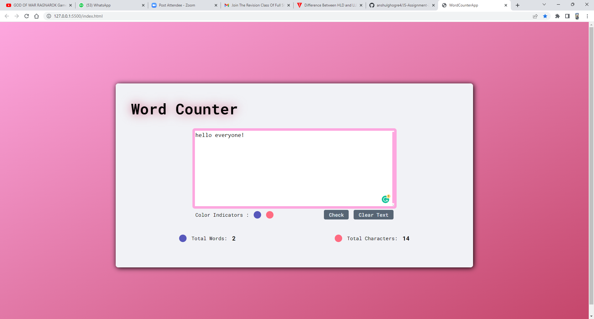

# Project: Word Counter App

## Task

- Here we have to make a word counter with HTML,CSS and JS in a way, when after typing in text area, it should show total number of words and total number of characters.

---

## ScreenShots

---

## Key learnings

- Revision of fetching values from the input and applied possible logic.

---

## Time taken

- Honest time taken for it to do is 4 hours.

---

## Live link

- [Word Counter App](https://js-assig-2-word-counter-app.netlify.app/)
